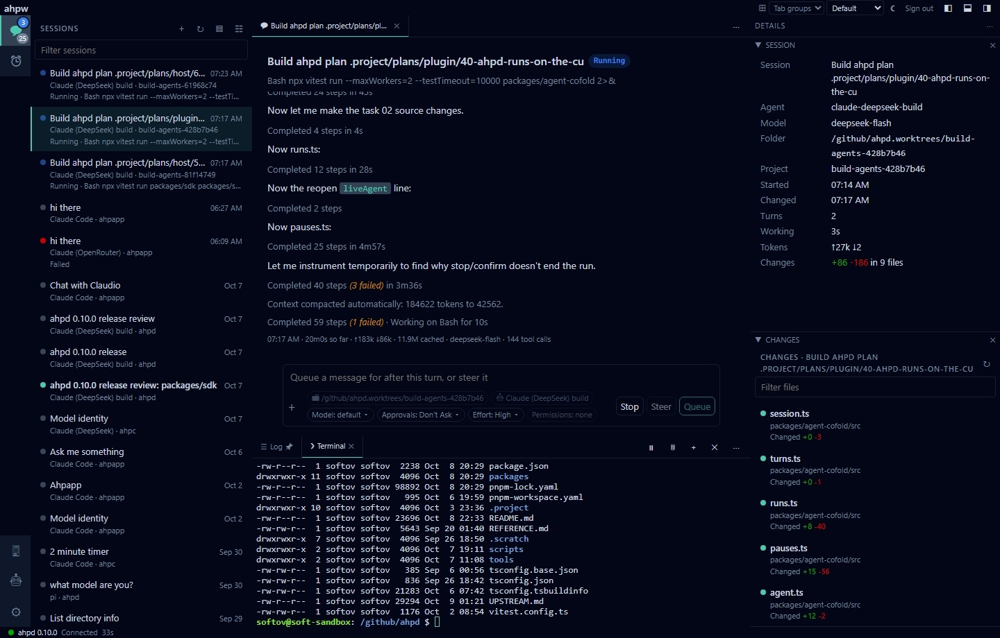
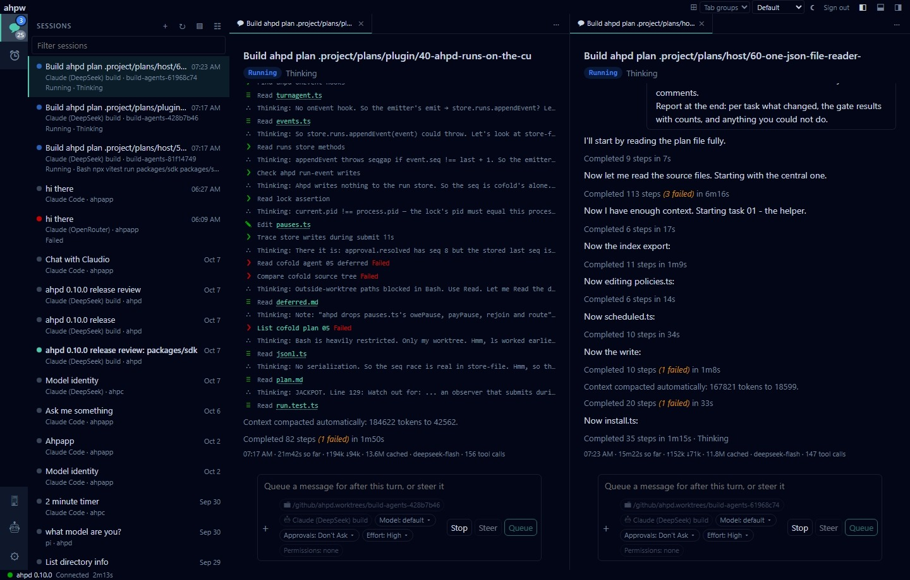

# @ahpd/web

[](https://github.com/softov/ahpw/actions/workflows/ci.yml)
[](https://www.npmjs.com/package/@ahpd/web)


A web UI for an [Agent Host Protocol](https://microsoft.github.io/agent-host-protocol/) server.

Run it inside [ahpd](https://github.com/softov/ahpd) as a plugin, or on its own with `ahpw serve` in front of any AHP server.

What you get:

- **Sessions**, the list, each chat, new sessions and what they changed.
- **Composer**, supports `@attachments`, `/skills` and `/commands`.
- **Explorer**, the host's folders as a tree: the default folder first, then each session's. Drag a file to the composer to attach it, or with Shift to write its path.
- **Automations** for running tasks and scripts automatically based on session events.
- **Terminals** and a log in a bottom panel.
- **Host Information**, shows details about the server and its environment.
- **Agents**, the ones the host offers: their models, customizations and sign-in, and a new session with one.
- **Settings**, configure the host server and its plugins.
- **Administration screens** for every ahpd command (ahpd only). They are built from the daemon's `/api/cli-manifest`, so a new command shows up here with no change to this package.

<picture>
  <source media="(prefers-color-scheme: light)" srcset="docs/media/shot-01-light.jpeg">
  
</picture>

Two sessions side by side:



---

## Run it in ahpd

Install the plugin:

```sh
ahpd plugin install @ahpd/web
```

That installs it where the daemon looks for plugins and adds it to `plugins` in the configuration file.
> **Note:** A plugin installed with `npm i -g` is not seen.

Turn on the API on the daemon's own port:

```json
{
  "http": true,
  "plugins": ["@ahpd/web"]
}
```

Then open `http://127.0.0.1:9187/plugins/ahpd-web/`.

Keep `http.port` unset. On another port the API is on another origin, and the page cannot reach it.

---

## Run it on its own

```sh
npm i -g @ahpd/web
# --connect {HOST_URL} --token-file {PATH_TO_TOKEN}
ahpw serve --connect ws://127.0.0.1:9187 --token-file ~/.config/ahpd/token
```

Or without installing it:

```sh
npx @ahpd/web serve --connect ws://127.0.0.1:9187 --token-file ~/.config/ahpd/token
```

Then open `http://127.0.0.1:5190/`.

- **With a token**, the server adds it to the socket. The page asks for nothing, and the browser never sees the token.
- **Without one**, the page asks for a token, as it does in ahpd.
- The administration screens need ahpd's `/api`, so they are not here.

### Options

| Option | What it does |
| --- | --- |
| `--connect URL` | The server's socket: `ws://`, `wss://`, `http://`, `https://` or `HOST:PORT` |
| `--token SECRET` | The token to add to the socket |
| `--token-file PATH` | Read the token from a file |
| `--host ADDR` | Bind here, default `127.0.0.1` |
| `--port N` | Listen here, default `5190` |
| `--open` | Open the page in a browser |

A `tkn=` in the `--connect` URL counts as the token.

### Config file and environment

Every option can go in `~/.config/ahpw/config.json`, without the dashes:

```json
{
  "connect": "ws://127.0.0.1:9187",
  "tokenFile": "~/.config/ahpd/token"
}
```

With no `connect` anywhere, `ahpw serve` reads the environment:

1. `AHPD_URL`, else `AHPD_HOST`, for the server
2. the `tkn=` in that URL, else `AHPD_TOKEN`, for the token

```sh
AHPD_URL="ws://127.0.0.1:9187/?tkn=$(cat ~/.config/ahpd/token)" ahpw serve
```

A flag beats the file, and the file beats the environment.

### Security

- The server binds `127.0.0.1` by default. Anyone who reaches it uses the AHP server with your token, so it warns when `--host` opens it up.
- It takes a socket only from a page it served, at an IP address or `localhost`.
- It warns when the token goes in cleartext (`ws://`) to another machine.

---

## Sign-in

Without a token from `ahpw serve`, sign in with one the server accepts: the deployment's token, or a person's token.

Each ahpd command checks its own grants. A token that may not run one gets ahpd's refusal.

The socket carries the token as `?tkn=`, because a browser cannot set a header on a WebSocket.

---

## Develop

ahpw speaks the protocol through [`@microsoft/agent-host-protocol`](https://github.com/microsoft/agent-host-protocol), the spec and its TypeScript SDK.

```sh
pnpm install
pnpm dev
```

`pnpm dev` serves on `http://127.0.0.1:5180`. It proxies `/api` and the socket (at `/ahp`) to `AHPD_URL`, default `http://127.0.0.1:9187`. The daemon needs `"http": true`.

```sh
AHPD_URL=http://127.0.0.1:9187 pnpm dev            # another daemon
AHPD_URL=http://127.0.0.1:9187 pnpm dev --port 5200 # extra args go to Vite
```

To try a local build in ahpd:

```sh
pnpm build
ahpd run --plugin /path/to/ahpd-web
```

| Script | What it does |
| --- | --- |
| `pnpm dev` | Vite, with `/api` and the socket proxied to a daemon |
| `pnpm build` | The page into `dist/app`, the plugin into `dist/plugin`, the CLI into `dist/cli` |
| `pnpm typecheck` | Every TypeScript project |
| `pnpm test` | The unit tests, for the page, the plugin and the CLI |

---

## Release

CI runs on every push to `main`: typecheck, tests, build, and the packed package installed and served once.

A `v*` tag releases. It must match `version` in `package.json`:

```sh
git tag v0.1.0 && git push origin v0.1.0
```

The release workflow runs the same checks and stages `@ahpd/web` on npm with provenance. Nothing is installable until it is approved on the package's npm page.

npm sets a trusted publisher on a package that exists, so the first version is published once by hand with `pnpm build && npm publish --access public`, and the trusted publisher (`softov/ahpw`, `release.yml`) is added after it.

---

## Layout

| Path | What it is |
| --- | --- |
| `plugin/` | The ahpd plugin: one route serving `dist/app` |
| `cli/` | `ahpw serve`: the same route on its own server, and the socket proxy |
| `src/connection/` | The AHP connection, the socket address, the protocol versions offered |
| `src/sessions/` | The sessions list, a new session, a session's chat and details |
| `src/folders/` | The explorer: the host's folders, and a host file dragged to the composer |
| `src/agents/` | The agents the server offers |
| `src/changes/` | What a session changed |
| `src/files/` | File, Markdown and diff viewers |
| `src/terminals/` | The server's terminals |
| `src/log/` | The log page |
| `src/panel/` | The bottom panel |
| `src/automations/` | The automations list and an automation's page |
| `src/commands/` | The command list, the command page, the result view |
| `src/manifest/` | The manifest's types, commands to forms and requests |
| `src/host/` | The host's settings |
| `src/notify/` | Toasts, confirm dialogs, browser notifications |
| `src/view/` | The palette, layouts and key bindings |
| `src/explorer/` | The list the sidebar sections share |
| `src/AhpwMark.tsx` | The logo, on the sign-in page and while loading |
| `src/token-provider.ts` | Sign-in with a token |

---

## License

MIT © Softov
